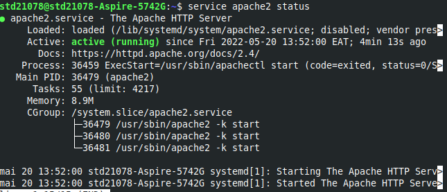
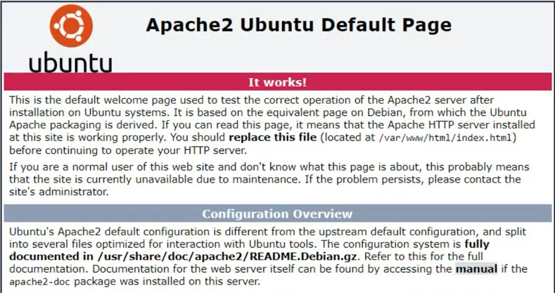
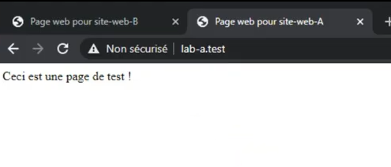

# serveur apache

## Description

 Un serveur HTTP permet à un site web de communiquer avec un navigateur en utilisant le protocole HTTP(S) et ses extensions (WebDAV, etc.). Apache est probablement le serveur HTTP le plus populaire. C'est donc lui qui met à disposition la plupart des sites Web du WWW.
 
Il est produit par la Apache Software Foundation. C'est un logiciel libre fourni sous la licence spécifique Apache.

On utilise généralement Apache en conjonction avec d'autres logiciels, permettant d'interpréter du code et d'accéder à des bases de données. Le cas le plus courant est celui d'un serveur LAMP (Linux Apache MySQL PHP).

## Installation

Vérification des mises à jours

> `sudo apt-get update`

Installer Apache2

> `apt-get install apache2`

Vérifier le status

> `service apache2 status`



## Testes et vérifications

Pour tester le serveur, entrer **localhost** sur la barre d'adresse du navigateur internet.

Si tout marche bien cela affichera la page par défaut de Apache2



Vérifier les fichiers journaux d'apache

> `tail /var/log/apache2/access.log`

Une journal contient :
> `127.0.0.1 - - [20/May/2022:13:54:35 +0300] "GET / HTTP/1.1" 200 1006 "-" "Mozilla/5.0 (X11; Linux x86_64; rv:100.0) Gecko/20100101 Firefox/100.0"`

>`127.0.0.1` => l'adresse ip du client <br>
>`20/May/2022:13:54:35 +0300` => la date d'accès <br>
>HTTP/1.1" 200 1006 => l'url consulté

Pour afficher les erreur liés au service apache

> `tail /var/log/apache2/error.log`

## Configuration du serveur apache pour héberger plusieurs sites web

Créer des répertoires pour chaque site web

>`sudo mkdir /var/www/site-web-A`<br>
>`sudo mkdir /var/www/site-web-B`

Mettre à jour le propriétaire de ces 2 répertoires

>`chown -R bob:bob-grp /var/www/site-web-A`
>
>`chown -R bob:bob-grp /var/www/site-web-B`

Mettre à jour les permissions sur les 2 répertoires

>`chmod -R 755 /var/www/site-web-A/`
>
>`chmod -R 755 /var/www/site-web-A/`

Créer les pages d'acceuil pour les 2 sites

>`nano /var/www/site-web-A/index.html`

```
<html>
<head>
	<title> Page web pour site-web-A</title>
</head>
<body>
	<p> Ceci est une page de test !</p>
</body>
</html>
```

>`nano /var/www/site-web-B/index.html`

```
<html>
<head>
	<title> Page web pour site-web-B</title>
</head>
<body>
	<p> Ceci est une page de test !</p>
</body>
</html>
```

Créer les 2 hôtes virtuels
> `sudo nano /etc/apache2/sites-availables/site-A.conf`

```
<VirtualHost *:80>
	#ServerAdmin est l'adresse email de l'administrateur du site web
	ServerAdmin bob@lab-a.test
	ServerName lab-a.test
	ServerAlias www.lab-a.test

	#DocumentRoot indique les informations sur les fichiers du site web
	DocumentRoot /var/www/site-web-A/
	ErrorLog ${APACHE_LOG_DIR}/error.log
	CustomLog ${APACHE_LOG_DIR}/access.log combined
</VirtualHost>
```

> `sudo nano /etc/apache2/sites-availables/site-B.conf`

```
<VirtualHost *:80>
	ServerAdmin bob@lab-b.test
	ServerName lab-b.test
	ServerAlias www.lab-b.test

	DocumentRoot /var/www/site-web-B/
	ErrorLog ${APACHE_LOG_DIR}/error.log
	CustomLog ${APACHE_LOG_DIR}/access.log combined
</VirtualHost>
```

Acitver les 2 hôtes virtuels

> `sudo a2ensite site-A.conf`
>
> `sudo a2ensite site-B.conf`

Vérifier les fichiers de configuration

>`sudo apache2ctl configtest`

Recharger le service apache

> `systemctl reload apache2`

## Configuration du pc client (windows)

Allez dans **C:\windows\System32\drivers\etc** et ouvrir le fichier **host** (en tant qu'administrateur) avec un éditeur de texte.

Ajouter les lignes :

```
192.168.1.60 www.lab-a.test
192.168.1.60 www.lab-b.test
```
Puis enregistrer

Ouvrir un navigateur web et entrer l'adresse
>`http://www.lab-a.test`

