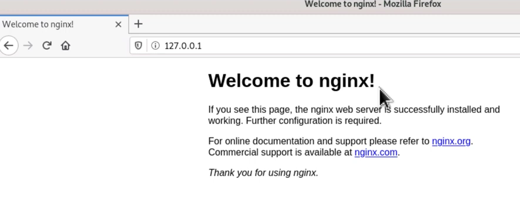

# Nginx

## Installation

Avant de démarrer l'installation de nginx, il est nécessaire de mettre à jour la liste des paquets :

> ``sudo apt install update``

Installer le paquet nginx

> ``sudo apt install nginx``

Verifier si nginx est installé et actif :

> ``sudo nginx -v``

> `sudo systemctl status nginx`

Activer le démarrage automatique de notre serveur nginx à chaque démarrage du système d'exploitation :

> `sudo systemctl enable nginx`

Ouvrir un navigateur et acceder à l'adresse localhost (127.0.0.1)



Le fichier html se trouve sur :

> `cd var/www/html`

## Configuration du serveur web

Créer un premier site avec nginx :

> `sudo mkdir /var/www/mon-site.hei`

Définir **www-data**, l'utilisateur par défaut de nginx comme propriétaire du site :

> `sudo chown -R www-data:www-data /var/www/mon-site.hei`

Attribuer les permissions nécéssaires pour le dossier de notre site :

> `sudo chmod 755 /var/www/mon-site.hei`

Créer un page **index.html**:

> `sudo nano /var/www/mon-site.hei/index.html`

```
	<html>
	    <head></head>
	    <body>
	        <h1>Bienvenue sur mon-site ! </h1>
	    </body>
	</html>
```
Préparons un fichier de configuration dans sites-available.

Créer un fichier de configuration correspondant à notre site :

> `sudo nano /etc/nginx/sites-available/mon-site.hei`

```
server {
	# site accessible sur le port 80 ipv4
	listen 80;
	# site accessible sur le port 80 ipv6
	listen [::]:80;
	
	# La racine du site
	root /var/www/mon-site.hei;
	
	# La page d'index du domaine
	index index.html;
	# Nom du domaine associé à notre site
	server_name mon-site.hei www.mon-site.hei;
	
	#règle qui permet de vérifier l'existence des dossiers ou fichier qui va être passés en paramètres de l'URL
	location / {
		try_files $uri/ =404;
	}
}
```

Maintenant notre configuration est prête, créer un **lien symbolique** dans **/etc/nginx/sites-enable/mon-site.hei** pour appliquer cette configuration

> `sudo ln -s /etc/nginx/site-available/mon-site.hei /etc/nginx/site-enabled/mon-site.hei`

Pour vérifier

> `ls -l /etc/nginx/site-enabled/`


Vérifier que tout les syntaxes du fichier de configuration sont parfaits

> `sudo nginx -t`

Rédemarrer notre serveur nginx

> `sudo systemctl restart nginx`

Testons de l'accès à notre nouveau site

Modifier le fichier hosts de linux;
> `sudo nano /etc/hosts`

ajoutons `0.0.0.0 mon-site.hei wwww.mon-site.hei`

Ouvrir le site `mon-site.hei` dans un navigateur


Pour surveiller les traces des requêtes http de notre site

> `sudo tail -f /var/log/nginx/access.log`

Pour tracer les erreurs en lien avec notre serveur nginx :

> `sudo tail -f /var/log/nginx/error.log`

### <a href='https://github.com/fenohei/SYS1/blob/main/README.md'> RETOUR</a>
