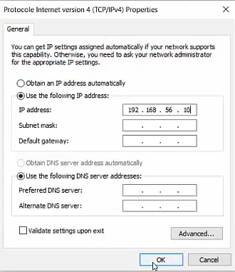
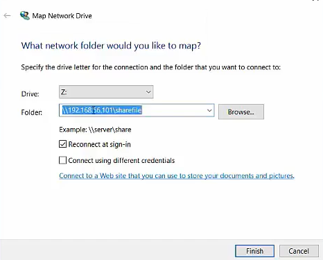
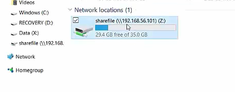
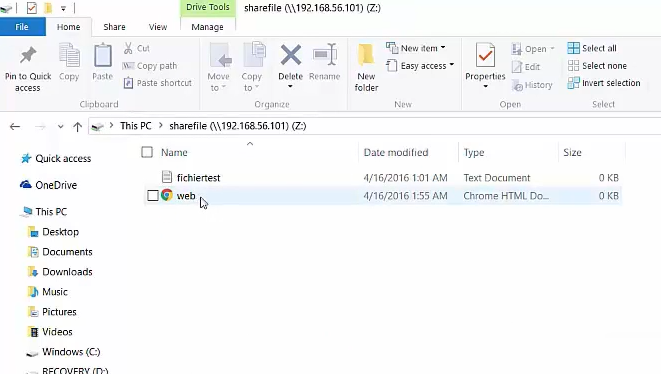

# Samba

## Description

Samba est un ensemble d'outils permettant de partager des ressources telles que des imprimantes
et des fichiers sur un réseau hétérogène. (C’est un serveur fichier)

Un serveur fichier : Un serveur de fichiers permet de partager des données à travers un réseau.
SMB : Le protocole SMB (Server Message Block) est un protocole permettant le partage de
ressources (fichiers et imprimantes) sur des réseaux locaux avec des PC sous Windows.

CFIS : une forme de SMB; CIFS est le sigle de “Common Internet File System”. CIFS est un
dialecte de SMB. Plus clairement, CIFS est une mise en œuvre particulière du protocole SMB,
créée par Microsoft.

## Installation

Avant de démarrer l'installation de samba, mettre à jour la liste des paquets :
> `sudo su`
>
> `apt-get update`

Proceder à l'installation de samba

> `apt-get install samba`

## Configuration
La configuration de samba se trouve dans le fichier **/etc/Samba/smb.conf**

Faire une copie du fichier original **smb.conf** :

> `/etc/Samba/smb.conf /etc/Samba/smb.conf.original`

Editer le fichier de configuration de samba
> `nano /etc/samba/smb.conf`

```
#Modifier wordgroup
workgroup = HEIGROUP

#Ajouter quelques règles

[sharefile]

#Chemin du dossier de partage
path = /home/sharefile

#permettre aux utilisateurs windows d'acceder à notre dossier de partage
browseable = yes

#permettre aux utilisateurs d'acceder à leur mot de passes
guest ok = yes


read only = no
create mask = 0755

```

Créer le dossier du partage

> `mkdir -p /home/sharefile`

Configuration de **NetBIOS name server**

> `nano etc/init/nmbd.conf`

commenter les deux lignes ci-dessous
```
# NMBD_DISABLED= `testparm -s --parameter-name='disable netbios' 2>/dev/null || true`

# [ "x$NMBD_DISABLED" = xYes] && { stop; exit 0; }
```

Redémmarrer les services **smbd** et **nmbd**
>`restart smbd`
>
>`restart nmbd`

Configurer l'interface réseau

>`if config`


Récuperer cette adresse ip `192.162.56.10` (pour notre exemple) vers le l'autre PC windows connecté à notre serveur

Dans le pc windows, aller dans **Control Panel > Network and Internet > Network Connections**

Clique droite sur le réseaux correspondant aux serveur et allez dans **Properties > Protocole Internet version 4 (TCP/IPv4) > Properties**



Créer un **Map Network Drive**
Allez dans **This PC > Map network drive



Retourner dans notre pc linux et créer un fichier dans le dossier de partage

>`touch /home/sharefile/web.html`

Entrer dans le pc windows et aller à **ThisPC > sharefile(\\192.168.56.101) (Z:)**


<br>
On retrouve le fichier partagé depuis linux <br>


### <a href='https://github.com/fenohei/SYS1/blob/main/README.md'> RETOUR</a>
