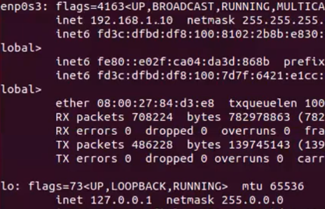
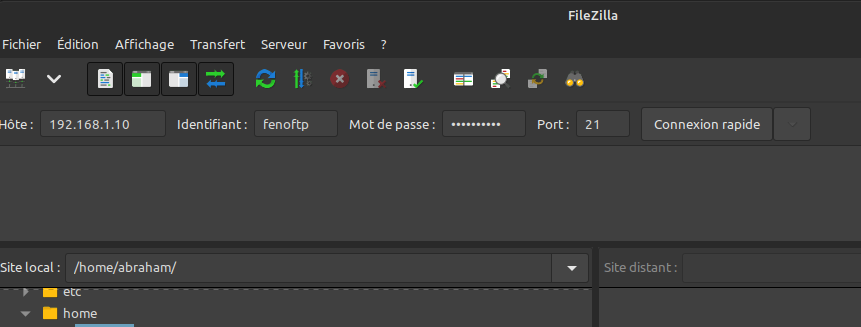

# Serveur vsftpd

## Description

Le serveur **FTP** permet de transférer des fichiers par Internet ou par le biais d'un réseau informatique local. Toute personne en ayant l'autorisation, peut télécharger et envoyer des fichiers sur un ordinateur distant faisant fonctionner un tel serveur. Le port par défaut et le plus souvent utilisé est le port 21.

Le serveur **VsFTPd** ou **Very Secure FTP daemon** est un serveur FTP conçu avec la problématique d'une sécurité maximale. Contrairement aux autres serveurs FTP (ProFTPd, PureFTPd, etc.), aucune faille majeure de sécurité n'a jamais été décelée dans VsFTPd. 

## Installation

Installer le paquet **vsftpd** sur le terminal :

> ``sudo apt install vsftpd``
>
Vérifier si le service est installé et actif :

> ``sudo systemctl status vsftpd``

Activer le pare-feu :

> ``sudo ufw enable``
>
> ``sudo ufw status``

Ouvrir les ports de votre pare-feu :

> ``ufw allow 20/tcp``
>
> ``ufw allow 21/tcp``
>
> ``ufw allow 990/tcp``
>
> ``ufw allow 40000:50000/tcp``

Créer un utilisateur :

> ``sudo adduser fenoftp``
>
> ``sudo mkdir /home/fenoftp/ftp``

Droit d'accès :
> ``sudo chown nobody:nogroup /home/fenoftp/ftp``
>
> ``sudo chomod a-w /home//home/fenoftp/ftp``
> ``ls -al /home/fenoftp/ftp``

Créer un dossier qui contiendra les fichiers du nouveau utilisateur **fenoftp**:

> mkdir /home/fenoftp/ftp/files

Attribuer ce dossier à l'utilisateur **fenoftp** :

> ``chown fenoftp:fenoftp /home/nadhir/ftp/files

## Configuration

La configuration de VsFTPd est centralisée dans un seul et même fichier **/etc/vsftpd.conf**

Faire une copie du fichier original **vsftpd.conf** :

> ``cp /etc/vsftpd/conf /etc/vsftpd.conf.original``

Ouvrir le fichier **/etc/vsftpd.conf** dans un éditeur de texte (en mode super utilisateur).

Si vouz êtes dans un terminal, tapez :
> ``sudo nano /etc/vsftpd.conf``

Modification de **vsftpd.conf**: 

> ``write_enable=YES``
>
> ``chroot_local_user=YES``
>
>``user_sub_token = fenoftp``
>
>``local_root=/home/fenoftp/ftp``
>
>``pasv_min_port = 40000``
>
>``pasv_max_port = 50000``
>
>``userlist_enable = YES``
>
>``userlist_file=/etc/vsftpd.userlist``
>
>``userlist_deny = NO``

Creer le fichier **vsftpd.userlist** qui contiendra **fenoftp** :

> ``echo "fenoftp" | sudo tee -a /etc/vsftpd.userlist``

## Utilisation

Redémarrer le service **vsftpd**:

> ``sudo systemctl restart vsftpd``

Télécharger et installer **FileZilla** : aller sur la page [filezilla-project.org](https://filezilla-project.org)

Tapez dans le terminal et tapez:
> ``ifconfig``

Récuperer l'adresse ip ``192.168.1.10`` (dans notre exemple)

Ouvrir FileZilla et remplir le formulaire Hôte, Identifiant, Mot de passe et Port :

Cliquez sur **Connexion rapide**

### <a href='https://github.com/fenohei/SYS1/blob/main/README.md'> RETOUR</a>
